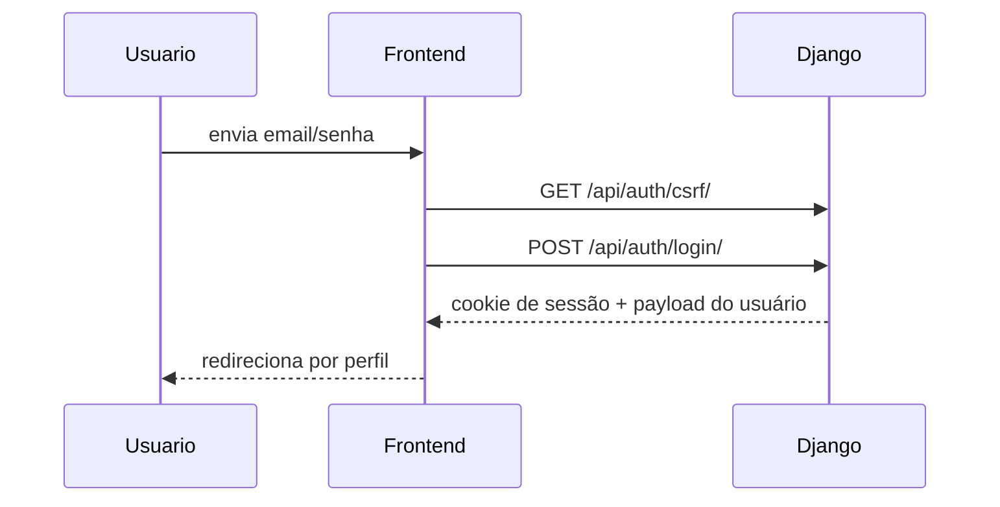
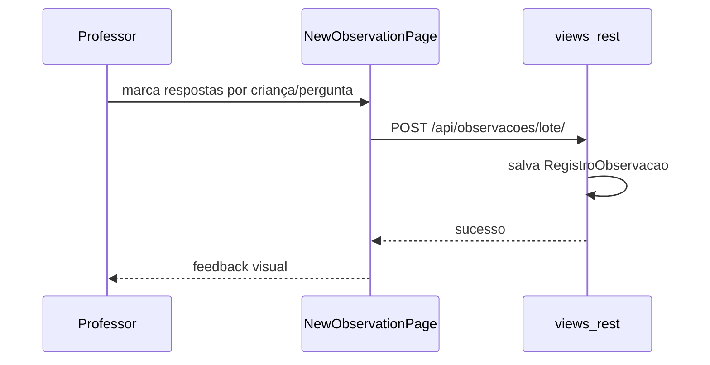
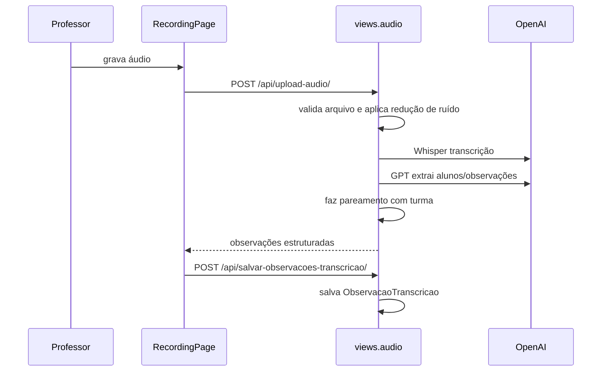
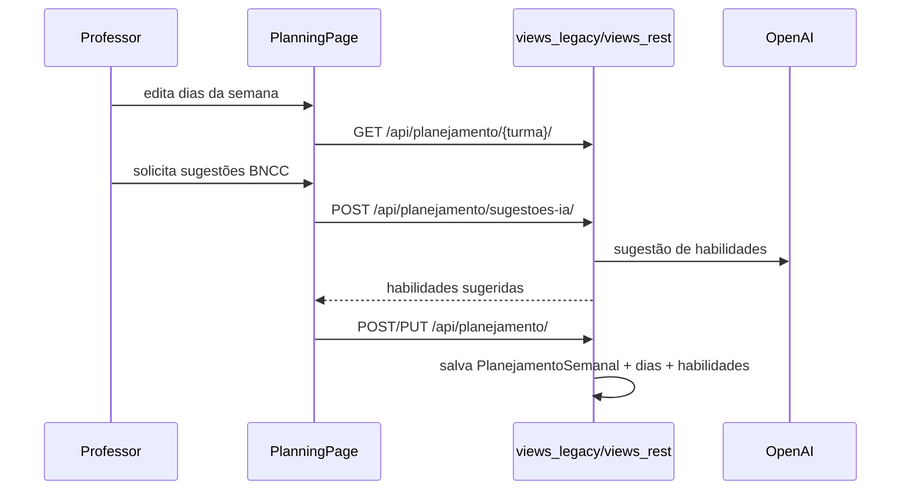
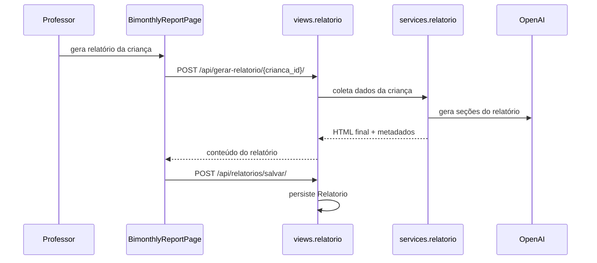

# PROJECT MAP

## Visão Geral

O repositório é uma aplicação full stack dividida em:

- `client/`: SPA em React + Vite.
- `server/`: backend Django 5 + Django REST Framework.
- `transcription_service/`: microserviço FastAPI + faster-whisper para transcrição local (alternativa ao Whisper da OpenAI).
- `report_generator/`: serviço auxiliar de geração de PDF para relatórios.
- `tests/`: testes E2E com Playwright.
- `docs/`: documentação operacional.
- `docker-compose*.yml`: orquestração local e produção.

Classificação automática:

- Frontend: React 19, Vite, React Router, Tailwind, Radix UI.
- Backend: Django, DRF, autenticação por sessão/cookie, PostgreSQL, integração com OpenAI e S3.
- Infra: Docker Compose, Gunicorn, Nginx de cliente, variáveis `.env`, Sentry.

## Arquitetura Resumida

O sistema é uma plataforma pedagógica para:

- autenticação de usuários por perfil (`admin`, `coordenador`, `professor`, `professor_especialista`, `especialista`);
- cadastro e gestão de instituições, turmas, alunos, períodos e perguntas BNCC;
- registros pedagógicos guiados, livres e multimídia;
- upload de portfólio;
- geração de relatórios com apoio de IA;
- indicadores e alertas de acompanhamento.

Padrões identificados:

- SPA + API REST.
- Sessão Django com cookies + CSRF.
- Camada de serviços no backend para IA, analytics, storage e relatórios.
- Camada de compatibilidade no frontend (`apiClient`) simulando um client estilo Supabase sobre a API REST.
- Convivência entre código novo e legado.

## Estrutura do Repositório

```text
.
├── client/
│   ├── public/
│   ├── src/
│   │   ├── components/
│   │   ├── contexts/
│   │   ├── hooks/
│   │   ├── lib/
│   │   ├── pages/
│   │   ├── services/
│   │   └── styles/
│   ├── plugins/
│   ├── Dockerfile*
│   ├── package.json
│   ├── tailwind.config.js
│   └── vite.config.js
├── server/
│   ├── api/
│   │   ├── management/commands/
│   │   ├── migrations/
│   │   ├── prompts/
│   │   ├── services/
│   │   ├── views/
│   │   ├── models.py
│   │   ├── serializers.py
│   │   ├── urls.py
│   │   ├── views_rest.py
│   │   ├── views_legacy.py
│   │   ├── views_clean.py
│   │   └── views_backup.py
│   ├── nara_api/
│   │   ├── settings.py
│   │   ├── urls.py
│   │   ├── asgi.py
│   │   └── wsgi.py
│   ├── manage.py
│   ├── requirements.txt
│   └── Dockerfile*
├── tests/
├── docs/
├── docker-compose.yml
├── docker-compose.prod.yml
└── README.md
```

## Entrypoints

### Frontend

- `client/src/main.jsx`
  - monta React, Router, `AuthProvider`, `Toaster`, health check e Sentry.
- `client/src/App.jsx`
  - registra todas as rotas da SPA.
- `client/src/contexts/AuthContext.jsx`
  - mantém sessão do usuário e expiração por inatividade.

### Backend

- `server/manage.py`
  - entrypoint de comandos Django.
- `server/nara_api/wsgi.py`
  - entrypoint WSGI para Gunicorn.
- `server/nara_api/asgi.py`
  - entrypoint ASGI.
- `server/nara_api/urls.py`
  - roteia `/admin/` e `/api/`.

### Infra

- `docker-compose.yml`
  - sobe `postgres`, `backend` e `frontend` para desenvolvimento.
- `docker-compose.prod.yml`
  - sobe stack de produção com Gunicorn.
- `client/vite.config.js`
  - configura alias `@`, proxy `/api` e plugins de editor visual em dev.

## Frontend

### Estrutura funcional

#### Núcleo

- `client/src/main.jsx`
  - bootstrap da aplicação.
- `client/src/App.jsx`
  - rotas públicas e protegidas.
- `client/src/contexts/AuthContext.jsx`
  - usa `apiClient.auth` para login, logout, leitura da sessão e timeout.
- `client/src/components/ProtectedRoute.jsx`
  - guarda de rotas por autenticação e perfil.
- `client/src/services/api.js`
  - camada de chamadas HTTP diretas para endpoints legados e REST.
- `client/src/lib/apiClient.js`
  - camada compatível com `.from(...).select().insert()` mapeando tabelas lógicas para endpoints REST.

#### Páginas principais

- `pages/LoginPage.jsx`
  - login e redirecionamento por perfil.
- `pages/ProfessorHomePage.jsx`
  - dashboard inicial do professor.
- `pages/NewObservationPage.jsx`
  - registro guiado, observação por IA e upload para portfólio.
- `pages/RecordingPage.jsx`
  - fluxo dedicado de gravação/transcrição de áudio.
- `pages/PlanningPage.jsx`
  - planejamento semanal por turma.
- `pages/PortfoliosPage.jsx`
  - listagem e curadoria de portfólio por criança.
- `pages/PortfolioPage.jsx`
  - visualização individual do portfólio.
- `pages/PortfolioTimelinePage.jsx`
  - timeline de registros da criança.
- `pages/ReportSelectionPage.jsx`
  - seleção de turma/criança para relatórios.
- `pages/BimonthlyReportPage.jsx`
  - consolidação do relatório da criança.
- `pages/CoordinatorHomePage.jsx`
  - painel da coordenação com visões de dashboard, planejamentos, relatórios, professores, alertas e indicadores.
- `pages/AdminPage.jsx`
  - painel administrativo com tabs.
- `pages/ProjectsPage.jsx`
  - CRUD de projetos pedagógicos.
- `pages/SpecialistHomePage.jsx`
  - home do especialista.
- `pages/SpecialistObservationPage.jsx`
  - formulário de observação especializada.
- `pages/SpecialistReportPage.jsx`
  - contribuições do especialista para relatório; implementação ainda parcial.

#### Conjuntos de componentes

- `components/admin/`
  - gestão de instituição, séries, turmas, usuários, alunos, períodos, perguntas e configurações de relatório.
- `components/coordinator/`
  - visões da coordenação.
  - `TeachersView.jsx` lista professores e expõe drill-down "Ver Produção" por professor.
  - `ProductionStudentsList.jsx` carrega sob demanda os alunos atendidos por um professor, agrupados por turma; navega para `/relatorios/:id` ao clicar.
- `components/observations/`
  - blocos de observação guiada, livre e análise de mídia.
- `components/portfolio/`
  - upload, edição e cards de portfólio.
- `components/report/`
  - editor, visualização e blocos de relatório.
- `components/projects/`
  - formulário e cards de projetos.
- `components/specialist-observation/`
  - formulários por especialidade.
- `components/ui/`
  - design system baseado em Radix + Tailwind.

### Gerenciamento de estado

- Estado local com `useState` e `useEffect`.
- Autenticação centralizada em `AuthContext`.
- Sem Redux/Zustand.
- `apiClient` funciona como fachada de dados, não como store.

### Navegação

Fluxo principal por perfil:

- login -> redireciona para `/admin`, `/coordenacao` ou `/home-professor`.
- professor -> registros, gravação, portfólios, planejamentos, relatórios.
- coordenador -> dashboard consolidado e alertas.
- admin -> cadastros estruturais.
- especialista -> observações e contribuições.

### Chamadas para API

Há dois padrões coexistindo:

1. `apiClient.from(...)`
- usado como camada de compatibilidade para listagem/mutação REST.
- exemplos: `usuarios`, `criancas`, `turmas`, `relatorios`, `periodos_avaliativos`.

2. `apiService`/`authFetch`/`fetch`
- usado para fluxos específicos e endpoints legados.
- exemplos: `upload-audio`, `planejamento/sugestoes-ia`, `portfolio/upload`, `gerar-relatorio`.

### Arquivos relevantes do frontend

- `client/src/services/api.js`
  - maior concentrador de integrações HTTP.
  - expõe uploads, relatórios, CRUDs, indicadores e autenticação auxiliar.
- `client/src/lib/apiClient.js`
  - traduz tabelas lógicas em paths REST.
  - também implementa `auth.getSession`, `signInWithPassword`, `signOut`.
- `client/src/lib/pdfGenerator.js`
  - geração de PDF no frontend, usado em relatórios/planejamento.
- `client/src/lib/dateUtils.js`
  - utilidades para períodos avaliativos e datas.
- `client/src/lib/observationUtils.js`
  - busca e organização de perguntas de observação.
- `client/src/hooks/useReportGeneration.js`
  - orquestra geração, edição e salvamento de relatórios.
- `client/src/hooks/useHealthCheck.js`
  - monitoramento de disponibilidade da API.

## Backend

### Framework e organização

- Framework principal: Django 5.2.
- API: Django REST Framework.
- Autenticação: `SessionAuthentication`.
- Persistência: PostgreSQL, com fallback opcional para SQLite.
- Storage: S3 com fallback local para uploads.
- IA: OpenAI para transcrição, análise de mídia e geração de relatórios.

### Arquivos principais

- `server/nara_api/settings.py`
  - configuração global, apps, middleware, banco, CORS, CSRF, Sentry, cache.
- `server/api/urls.py`
  - catálogo central de endpoints.
- `server/api/views_rest.py`
  - CRUD REST de entidades principais.
- `server/api/views_legacy.py`
  - grande bloco legado com fluxos antigos e ainda ativos.
- `server/api/views/__init__.py`
  - faz merge de `views_legacy`, `views_rest` e sobrescreve alguns handlers com views mais novas.

### Modelos de dados

Arquivo: `server/api/models.py`

#### Autenticação e estrutura institucional

- `Instituicao`
  - escola, dados institucionais e configuração de relatórios.
- `Usuario`
  - usuário do sistema com perfis e tipo de especialista.
- `SerieConfig`
  - configuração de séries/faixas etárias.
- `Turma`
  - turma, faixa etária, turno, ano letivo.
- `UsuarioTurma`
  - vínculo N:N entre usuários e turmas.
- `ConfiguracaoRegistro`
  - frequência de registro por turma.

#### Registros pedagógicos e mídia

- `RegistroEscrita`
  - upload + análise de escrita.
- `RegistroDesenho`
  - upload + análise de desenho.
- `ObservacaoTranscricao`
  - observações extraídas de áudio/transcrição.
- `RegistroObservacao`
  - observações estruturadas por pergunta BNCC.

#### Planejamento e BNCC

- `HabilidadeBNCC`
  - habilidades oficiais.
- `PlanejamentoSemanal`
  - planejamento por semana e turma.
- `PlanejamentoDiario`
  - detalhamento diário.
- `PlanejamentoHabilidade`
  - vínculo entre planejamento diário e habilidade BNCC.
- `PerguntaBNCC`
  - perguntas facilitadoras BNCC.
- `PerguntaEspecialista`
  - perguntas livres por especialista/nível.
- `CampoExperienciaCustomizado`
  - campos extras configuráveis.

#### Portfólio, relatórios e suporte

- `Crianca`
  - aluno/criança.
- `Relatorio`
  - relatório gerado/salvo.
- `ProducaoCrianca`
  - produção individual da criança.
- `ProducaoFoto`
  - mídia genérica de portfólio.
- `ProducaoFotoCrianca`
  - vínculo N:N foto <-> criança.
- `Projeto`
  - projeto pedagógico.
- `PeriodoAvaliativo`
  - período institucional.
- `CalendarioBimestre`
  - calendário letivo.
- `MensagemCoordenacao`
  - mensagens institucionais.
- `MensagemLida`
  - leitura de mensagens.
- `AlertaLido`
  - leitura de alertas.

### Serializers

Arquivo: `server/api/serializers.py`

Responsabilidades:

- serialização CRUD de entidades principais;
- aliases de compatibilidade para o frontend;
- validação de `PerguntaEspecialista`;
- serialização aninhada para planejamentos (`PlanejamentoSemanalSerializer`, `PlanejamentoDiarioSerializer`);
- mapeamento de `instituicao_id` em `UsuarioSerializer`;
- `RelatorioListSerializer`: versão enxuta usada em listagens; expõe `finalizado` (derivado de `LENGTH(conteudo)` anotado na query) sem trafegar o blob HTML. Relatório individual continua usando `RelatorioSerializer` completo.

### Serviços e regras de negócio

#### `server/api/services/relatorio.py`

- coleta dados da criança, observações, produções e BNCC;
- consulta prompts HTML/texto;
- chama OpenAI para gerar:
  - seção de atividades;
  - relatos individuais;
  - análise de produções;
  - conclusão;
- monta HTML final com template `relatorio_template.html`.

#### `server/api/services/relatorio_pdf.py`

- `ensure_pdf(relatorio)`: garante um PDF cacheado (S3 ou local) para o relatório, renderizando via Report Generator quando necessário.
- `invalidate_pdf_cache(relatorio)`: descarta PDF cacheado quando o conteúdo muda — limpa `pdf_url`/`pdf_storage_key` e remove o arquivo do S3. Chamado por `atualizar_relatorio` para evitar download de PDF obsoleto após edição.

#### `server/api/services/audio.py`

- normaliza o áudio para WAV 16 kHz mono com `ffmpeg` (havia uma etapa de redução de ruído com `noisereduce`, removida em set/2026: o Whisper é treinado em áudio ruidoso e ela custava 18s num áudio de 30s);
- transcreve via factory `api/transcription/` (Strategy pattern): `OpenAIBackend` (Whisper-1 da OpenAI, default) ou `FasterWhisperBackend` (cliente HTTP do microserviço `transcription_service/`), selecionado por `TRANSCRIPTION_PROVIDER`;
- extrai observações com GPT;
- faz matching aproximado entre nomes detectados e alunos da turma.

#### `server/api/services/crianca.py`

- `listar_criancas_filtradas`: consulta de `Crianca` com filtros opcionais `crianca_id`, `crianca_id_in` (CSV), `turma_id`, `turma_id_in` (CSV), `instituicao_id`, `status_vinculo`.
- pré-carrega nomes de turma em uma única query (`Turma.objects.filter(id__in=...)`) para evitar N+1 no serializer.

#### `server/api/services/analise_producao.py`

- upload S3/local de arquivos;
- análise de escrita e desenho com prompts;
- persistência de `RegistroEscrita` e `RegistroDesenho`.

#### `server/api/services/analytics.py`

- contagem de registros por instituição;
- participação docente por volume de atividade, relatórios, planejamento e portfólio.

#### `server/api/services/alerts.py`

- gera alertas semanais para professor e coordenação com base em registros insuficientes.

#### `server/api/services/language_development.py`

- calcula indicador de linguagem por turma combinando leitura, fala e escrita.

#### `server/api/services/password_reset.py`

- emite token de recuperação;
- envia e-mail via Mailtrap API;
- confirma redefinição de senha.

### Views por camada

#### REST principal

Arquivo: `server/api/views_rest.py`

Responsável por:

- CRUD de `criancas`, `relatorios`, `observacoes`, `producoes-criancas`;
- CRUD de `perguntas-bncc`, `perguntas-especialistas`, `periodos-avaliativos`, `turmas`, `projetos`, `instituicoes`, `usuarios`, `series-config`, `campos-experiencia`;
- autenticação por sessão (`auth/csrf`, `auth/login`, `auth/logout`, `auth/me`);
- mensagens, alertas, indicadores e planejamentos agregados;
- upload/refresh de PDF de relatório.

#### Views novas segmentadas

- `server/api/views/audio.py`
  - upload de áudio e resposta estruturada de transcrição.
- `server/api/views/analise_producao.py`
  - upload/análise de escrita/desenho e servir arquivos.
- `server/api/views/relatorio.py`
  - geração de relatório com IA, download individual de PDF, `bulk_pdf_relatorios` (stream NDJSON com eventos `progress`/`zipping`/`uploading`/`done`) e `atualizar_relatorio` (com invalidação automática do PDF cacheado quando `conteudo` muda).
- `server/api/views/analytics.py`
  - contagem de registros e participação docente.

#### Legado

- `server/api/views_legacy.py`
  - concentra regras antigas ainda consumidas:
  - planejamento semanal;
  - portfólio legado;
  - upload logo;
  - observações por transcrição;
  - perguntas/habilidades BNCC;
  - melhoria de texto;
  - listagens de registros e uploads.
- `server/api/views_clean.py`
  - cópia parcial/alternativa antiga.
- `server/api/views_backup.py`
  - backup de outra versão anterior.

### Endpoints principais

Base: `/api/`

#### Saúde e utilitários

- `GET /health/`
- `GET /hello/`
- `GET /arquivo/{arquivo_hash}/`
- `POST /proxy-imagem/`

#### Autenticação

- `GET /auth/csrf/`
- `POST /auth/login/`
- `POST /auth/logout/`
- `GET /auth/me/`
- `POST /auth/recuperar-senha/`
- `POST /auth/confirmar-senha/`

#### Cadastros

- `GET|POST /criancas/` e variantes `/criar`, `/{id}`, `/{id}/atualizar`, `/{id}/deletar`
  - listagem aceita filtros `id`, `id__in` (CSV), `turma_id`, `turma_id__in` (CSV), `instituicao_id`, `status_vinculo` — `id__in`/`turma_id__in` são usados pelo drill-down "Ver Produção" do coordenador para buscar várias turmas em uma única requisição.
- equivalente para `turmas`, `usuarios`, `instituicoes`, `projetos`, `periodos-avaliativos`, `series-config`, `campos-experiencia`

#### Registros e observações

- `GET /observacoes/`
- `POST /observacoes/criar/`
- `POST /observacoes/lote/`
- `POST /upload-audio/`
- `POST /salvar-observacoes-transcricao/`
- `GET /buscar-observacoes-transcricao/`
- `POST /leitura/analisar/` — inicia análise no NaraNN
- `GET /leitura/<id>/status/` — consulta classe predita + probabilidades
- `POST /leitura/<id>/confirmar/` — confirma classe escolhida e salva áudio no S3
- `DELETE /leitura/<id>/` — cancela registro pendente

#### Produções e portfólio

- `POST /upload-escrita/`
- `POST /upload-desenho/`
- `GET /registros-escrita/`
- `GET /registros-desenho/`
- `POST /portfolio/upload/`
- `GET /portfolio/listar/`
- `PATCH /portfolio/vinculo/{id}/`
- `PATCH /portfolio/vinculos/lote/`
- `DELETE /portfolio/excluir/{id}/`
- `POST /producoes-criancas/upload/`

#### Planejamento

- `POST /planejamento/`
- `POST /planejamento/sugestoes-ia/`
- `GET /planejamento/{turma_id}/`
- `PUT /planejamento/atualizar/{planejamento_id}/`
- `GET /planejamentos/turma/{turma_id}/`
- `GET /planejamentos/`

#### Relatórios

- `POST /gerar-relatorio/`
- `POST /gerar-relatorio/{crianca_id}/`
- `GET /relatorios/` (usa `RelatorioListSerializer` + `.defer('conteudo')` — retorna `finalizado` sem o blob HTML)
- `POST /relatorios/salvar/`
- `GET /relatorios/{id}/` (lazy-load do `conteudo` completo quando o modal abre)
- `PUT /relatorios/{id}/atualizar/` (chama `invalidate_pdf_cache` quando `conteudo` muda)
- `POST /relatorios/{id}/pdf/`
- `POST /relatorios/{id}/pdf/refresh/`
- `POST /relatorios/bulk-pdf/` (stream NDJSON: `progress` → `zipping` → `uploading` → `done`)

#### Indicadores e alertas

- `GET /analytics/contagem-registros/`
- `GET /indicadores/linguagem/`
- `GET /indicadores/participacao-docente/`
- `GET /alertas/`
- `GET /alertas/detalhe/`
- `GET|POST /alertas-lidos/`

## Integração Frontend <-> Backend

### Mecanismo principal

1. O frontend autentica em `/api/auth/login/`.
2. O backend cria sessão Django e devolve cookie.
3. O frontend usa `credentials: include` em quase todas as chamadas.
4. Escritas usam `X-CSRFToken`.
5. O frontend alterna entre:
   - `apiClient.from('tabela')` para CRUD REST;
   - `apiService`/`fetch` para fluxos legados e uploads.

### Fluxos principais

#### Login



#### Registro guiado



#### Gravação com IA



#### Planejamento semanal



#### Relatório com IA



### Endpoints efetivamente consumidos no frontend

Mais usados:

- `/api/auth/*`
- `/api/criancas/*`
- `/api/turmas/*`
- `/api/usuarios/*`
- `/api/periodos-avaliativos/*`
- `/api/observacoes/*`
- `/api/gerar-relatorio/*`
- `/api/relatorios/*`
- `/api/planejamento/*`
- `/api/planejamentos/*`
- `/api/portfolio/*`
- `/api/upload-audio/`
- `/api/upload-escrita/`
- `/api/upload-desenho/`
- `/api/alertas/*`
- `/api/analytics/contagem-registros/`
- `/api/indicadores/participacao-docente/`
- `/api/indicadores/linguagem/`

### Formato de dados observado

Padrões recorrentes:

- autenticação:
  - request: `{ email, password, remember_me }`
  - response: `{ user, session, perfil, nome, instituicao_id, tipo_especialista }`
- observações em lote:
  - request: `{ registros: [{ crianca_id, pergunta_id, resposta, observacao, professor_id, data_observacao }] }`
- upload áudio:
  - request: `FormData(audio, turmaId, professora, tipo, alunosTurma)`
  - response: `{ success, transcricao, nao_identificados, avisos, metadados }`
- gerar relatório:
  - response: `{ success, content, period, generatedAt, suggestions, metadata }`
- planejamento:
  - request: `{ turma_id, semana_inicio, professora_id, professora_nome, dias }`

## Dependências Principais

### Frontend

Arquivo: `client/package.json`

- `react`, `react-dom`
- `react-router-dom`
- `vite`
- `framer-motion`
- `tailwindcss`
- `@radix-ui/*`
- `lucide-react`
- `recharts`
- `@sentry/react`
- `@tiptap/*`
- `jspdf`, `html2canvas`
- `react-speech-recognition`
- `browser-image-compression`
- `xlsx`

### Backend

Arquivo: `server/requirements.txt`

- `Django`
- `djangorestframework`
- `django-cors-headers`
- `gunicorn`
- `python-dotenv`
- `openai`
- `psycopg2-binary`
- `boto3`
- `Pillow`
- `mailtrap`
- `sentry-sdk`

### Testes

- `pytest`
- `playwright`
- `pytest-playwright`

## Infra e Configuração

### Desenvolvimento

- `docker-compose.yml`
  - backend executa migrations, tenta importar backup e sobe `runserver`.
- `client/vite.config.js`
  - proxy `/api -> backend`.

### Produção

- `docker-compose.prod.yml`
  - backend usa Gunicorn.
- `client/docker/nginx/default.conf`
  - configuração de Nginx para distribuição do frontend.

### Variáveis e serviços externos

- PostgreSQL
- OpenAI
- AWS S3
- Mailtrap
- Sentry

## Código morto, redundante ou suspeito

### Backend

- `server/api/views_clean.py`
  - não há referência ativa; aparenta ser cópia intermediária.
- `server/api/views_backup.py`
  - backup legado sem uso aparente.
- `server/api/views_legacy.py`
  - continua central para vários fluxos; grande acoplamento e difícil manutenção.
- `server/api/views/__init__.py`
  - mistura imports com `*` e sobrescritas manuais; aumenta risco de colisão.

### Frontend

- `client/src/pages/CoordinatorIndicatorsPage.jsx`
  - parece duplicado de `components/coordinator/IndicatorView.jsx`; não está roteado.
- `client/src/pages/TestAnalysisPage.jsx`
  - página de teste sem rota.
- `client/src/pages/TestProductionAnalysis.jsx`
  - página de teste sem rota.
- `client/src/pages/RecordingPage.jsx` e partes equivalentes em `NewObservationPage.jsx`
  - há duplicação significativa do fluxo de gravação/transcrição.
- `client/src/pages/BnccQuestionsPage.jsx` e `components/admin/PerguntasTab.jsx`
  - ambas implementam gestão de perguntas/campos com lógica muito parecida.

### Integrações sem contraparte clara no backend atual

O frontend referencia tabelas/rotas lógicas que não aparecem em `models.py` nem em `urls.py`:

- `projeto_turmas`
- `observacoes_comentarios`
- `observacoes_especialistas`
- `especialista_funcoes`
- `atendimentos_especialistas`

Isso sugere uma destas situações:

- legado vindo de Supabase/PostgREST;
- backend incompleto para essas features;
- código do frontend ainda não migrado.

## Problemas de Segurança e Confiabilidade

### Exposição de segredos/configuração sensível

- `server/nara_api/settings.py`
  - DSN do Sentry hardcoded.
  - token do Mailtrap hardcoded.
  - `SECRET_KEY` com fallback inseguro.

### Exposição excessiva de dados

- Sentry com `send_default_pii=True`.
- `traces_sample_rate=1.0` e `profile_session_sample_rate=1.0` em produção potencialmente coletam dados demais.
- várias views retornam `details: str(e)` em erro 500.
- `password_reset.py` imprime link de redefinição no console.

### Controle de acesso inconsistente

- `REST_FRAMEWORK.DEFAULT_PERMISSION_CLASSES = AllowAny`.
  - a proteção depende de cada view individualmente.
  - endpoints legados precisam ser auditados com cuidado.

### CORS/CSRF

- listas fixas extensas em `CORS_ALLOWED_ORIGINS` e `CSRF_TRUSTED_ORIGINS`.
- middleware customizado `PlanejamentoCorsMiddleware` replica parte do comportamento do `django-cors-headers`.

### Dependências operacionais implícitas

- fluxo de áudio depende de `ffmpeg`, mas isso não está documentado no código analisado.
- `password_reset.py` usa `requests`, porém a dependência não aparece explicitamente em `server/requirements.txt`.

## Pontos Fortes

- separação física clara entre `client` e `server`;
- modelos de domínio relativamente ricos e coerentes com o produto;
- backend já possui camada de serviços para regras pesadas;
- autenticação por sessão com CSRF, adequada para app web tradicional;
- integração com OpenAI, S3 e indicadores já estruturada;
- frontend possui boa cobertura de fluxos administrativos e pedagógicos;
- testes E2E existentes para regras críticas de permissão e cadastros.

## Melhorias Recomendadas

### Prioridade alta

1. Unificar a camada de API do frontend.
   Hoje coexistem `apiClient`, `apiService` e `fetch` direto.

2. Encerrar o legado de views.
   Migrar fluxos ativos de `views_legacy.py` para módulos versionados/coerentes e remover `views_clean.py`/`views_backup.py`.

3. Resolver tabelas/rotas órfãs.
   Confirmar se `projeto_turmas`, `observacoes_especialistas`, `observacoes_comentarios` etc. existem fora do Django ou se são dívida técnica.

4. Reforçar segurança de configuração.
   Mover DSN/tokens para variáveis de ambiente e remover fallbacks inseguros.

5. Reduzir duplicação do frontend.
   Consolidar:
   - `RecordingPage` vs `NewObservationPage` em áudio;
   - `CoordinatorIndicatorsPage` vs `IndicatorView`;
   - `BnccQuestionsPage` vs `PerguntasTab`.

### Prioridade média

1. Adotar permissões padrão mais restritivas no DRF.
2. Padronizar respostas de erro e remover `details` em produção.
3. Centralizar contratos de payload request/response.
4. Criar documentação formal de entidades e fluxos de autorização por perfil.
5. Cobrir com testes as integrações de IA, upload e relatórios.

### Prioridade baixa

1. Dividir arquivos muito grandes:
   - `views_rest.py`
   - `views_legacy.py`
   - `services/relatorio.py`
   - `services/api.js`
2. Criar OpenAPI/Swagger.
3. Introduzir tipagem no frontend para payloads críticos.

## Diagrama de Arquitetura

```text
┌──────────────────────────┐
│        Navegador         │
│ React + Router + UI      │
└─────────────┬────────────┘
              │
              │ cookies de sessão + CSRF
              ▼
┌──────────────────────────┐
│      Frontend Vite       │
│ App.jsx / AuthContext    │
│ apiService + apiClient   │
└─────────────┬────────────┘
              │
              │ /api/*
              ▼
┌──────────────────────────┐
│     Django + DRF API     │
│ urls.py / views_rest     │
│ views_legacy + views/*   │
└──────┬─────────┬─────────┘
       │         │
       │         ├───────────────────────────────┐
       │                                         │
       ▼                                         ▼
┌──────────────┐                         ┌────────────────┐
│ PostgreSQL   │                         │ OpenAI API      │
│ models.py    │                         │ áudio, mídia,   │
│ serializers  │                         │ relatórios      │
└──────┬───────┘                         └────────────────┘
       │
       ▼
┌────────────────┐
│ S3 / storage   │
│ uploads e PDFs │
└────────────────┘
```

## Resumo Arquitetural

O sistema funciona como uma SPA React autenticada por sessão Django. O frontend consome uma API híbrida: parte REST moderna em `views_rest.py`, parte legado em `views_legacy.py` e alguns módulos novos especializados. O backend centraliza regras de domínio pedagógico, persistência no PostgreSQL, uploads em S3 e processamento com OpenAI.

O maior ponto de atenção arquitetural hoje não é a ausência de estrutura, e sim a sobreposição de estruturas: há uma base boa, mas coexistem camadas duplicadas, contratos antigos e referências a entidades sem implementação visível no backend atual. O projeto já é funcional e relativamente completo, mas precisa de consolidação para reduzir risco operacional e acelerar evolução.
